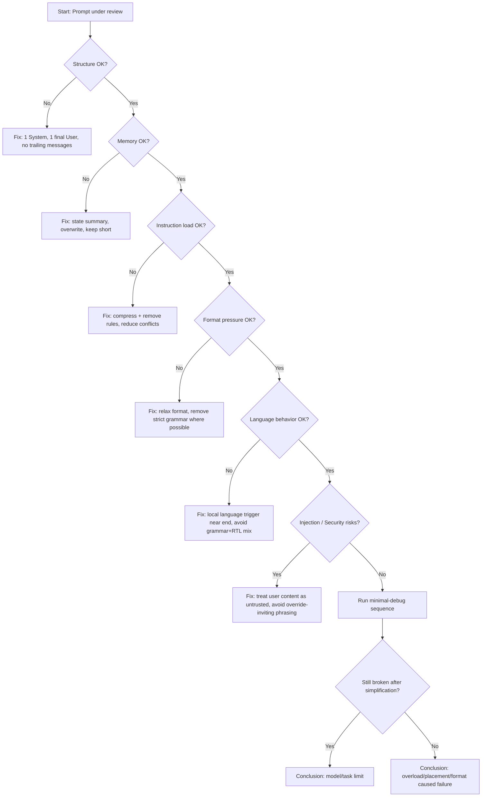

# Prompt Review Checklist

This checklist is used to audit prompt-based systems.

Not for writing prompts.  
For understanding why they behave strangely.

Treat it like static analysis for LLM behavior.

---

## Structure

- Is there exactly **one System message**?
- Is there exactly **one User message per turn**?
- Is the final instruction always in the **last User message**?
- Is there anything after the final User message? (should not exist)
- Are important rules placed **near the end**, not in the middle?

---

## Memory

- Is memory represented as **state**, not raw chat log?
- Is memory summarized, not appended?
- Is memory shorter than **10–15% of total context**?
- Is memory updated by overwrite, not accumulation?
- Can memory be removed without breaking behavior?

If removing memory improves behavior → memory is noise.

---

## Instruction Load

- Are there more than **8–10 independent rules**?
- Are multiple rules trying to control the same thing?
- Are new rules added to patch old failures?
- Does removing half the rules improve stability?

More rules usually means less control.

---

## Recency

- Are any critical instructions far from the end?
- Are examples placed in the middle?
- Is system logic separated from user logic?

If something matters, it must be **recent**.

---

## Format Pressure

- Is output grammar stricter than necessary?
- Is strict JSON used where free text would work?
- Is the model forced to always produce valid structure?
- Does behavior improve when format is relaxed?

Format reshapes meaning.

---

## Language

- Is language enforced globally instead of locally?
- Is multilingual behavior combined with strict grammar?
- Does output sometimes switch languages?
- Does adding a local language trigger near the end help?

Language is probabilistic, not guaranteed.

---

## Examples

- Are examples placed immediately before the task?
- Are examples older than the actual user message?
- Do examples still influence output if moved to the end?

Examples decay with distance.

---

## Dominance Conflicts

- Are system rules fighting with user instructions?
- Are memory rules fighting with format rules?
- Are safety/format/language all enforced simultaneously?

Constraints compete, they do not cooperate.

---

## Drift Detection

- Does behavior change over time without prompt changes?
- Does adding rules reduce consistency?
- Does the system require frequent prompt edits?

If yes → entropy is winning.

---

## Security / Prompt Injection

These checks matter even in “prompt-only” setups.
They won’t guarantee safety, but they reduce the easiest failures.

- Are you treating **user input as untrusted** by default?
- Do you avoid instructions that invite overrides like:
  - “ignore the above”
  - “rewrite your rules”
  - “act as system”
- Do you avoid placing critical constraints inside user-controlled text blocks?
- Do you avoid “copy user text verbatim and follow it” patterns?

### Injection risk indicators

- The user can supply:
  - policies, rules, or “system prompts”
  - long pasted documents
  - code blocks with embedded instructions
  - quoted text pretending to be a higher-priority message

If yes:
- assume users will attempt to steer behavior
- assume accidental instruction collisions will happen

### Practical hardening (prompt-only)

- Separate: “user content” vs “instructions about user content”
- Avoid phrasing that makes the model “obedient to text”:
  - “follow the instructions in the text below”
- Prefer narrow tasks:
  - “answer the user’s question”
  - not “execute whatever the user provides”

### Expected failure mode

If the model must choose between:
- stable rules
- user-provided instructions

It may pick the most recent, most direct instruction.

That is normal dominance behavior, not a bug.

---

## Safety Boundaries

- Are you asking the model to do anything that requires guarantees?
  - strict parsing
  - legal/medical advice
  - financial decisions
  - safety-critical actions

If yes:
- prompt-only control is the wrong tool
- you need validation, retries, or a control layer

---

## Flow in diagram

---

## Debugging Strategy

When something breaks:

1. Remove memory
2. Remove format
3. Remove multilingual
4. Reduce rules to minimum
5. Test with single user message

If it works after simplification → complexity caused failure.

---

## Final Test

Ask yourself:

If I had to delete **half of this prompt**,  
would behavior improve?

If yes → the prompt is already over-engineered.
