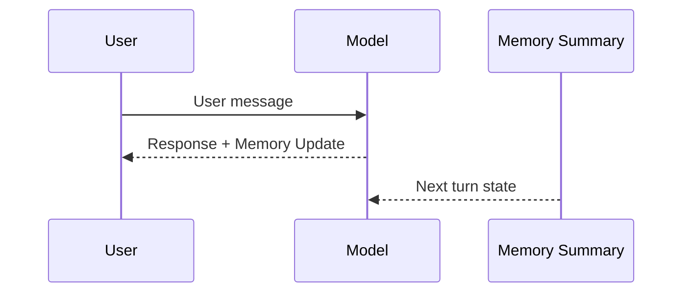

# 04 — Memory Without a Backend

Most people think memory means:
"store the conversation"

That is already wrong.

---

## The core mistake

Raw dialogue is not memory.

It is noise.

LLMs do not reason over history.
They condition on recent tokens.

Which means:
a long chat log does not create continuity,
it creates dilution.

---

## What the model actually needs

Not:
- who said what
- in what order
- with what tone

But:
- current state
- discovered constraints
- open problems
- decisions already made

Memory is not history.
Memory is state.

---

## Why chat logs fail as memory

A chat log contains:
- redundant information
- emotional filler
- formatting artifacts
- outdated decisions

The model has no mechanism to:
- filter,
- prioritize,
- or compress.

It just sees more tokens.

More tokens means:
less signal per token.

---

## The correct mental model

Treat memory like a state snapshot.

Not like:
chat.txt

But like:
state.json

Overwritten each turn.

## Memory state diagram

---

## What useful memory looks like

Not this:

User asked about budget.  
Assistant suggested low cost.  
User agreed.  
Assistant proposed Paris.

But this:

Goal: low budget Europe trip  
Current option: Paris  
Constraints: travel in May  
Open: itinerary details  

Same information.
Ten times more signal.
Ten times fewer tokens.

---

## Why memory must not grow

Growing memory creates:

- longer contexts,
- weaker system influence,
- higher chance of drift,
- and higher cost.

A good memory block:
- stays under 150 tokens,
- is overwritten, not appended,
- contains only stable facts.

---

## The overwrite rule

Memory should behave like:

state = f(previous_state, new_information)

Not like:

state = state + history

Append-only memory is a slow failure mode.

---

## Why summarization is not compression

Summarization is not:
"shorter version of the chat"

It is:
"projection into a different representation"

From:
events

To:
facts

From:
dialogue

To:
state

---

## The placement rule

Memory is only useful
if it is near the decision point.

Memory in the middle:
rarely used.

Memory near the last user:
frequently used.

Same text.
Different position.
Different effect.

---

## The cost illusion

People worry about token cost.

They keep raw history
because "it's already there".

In reality:
raw history is the most expensive option.

You pay for:
- irrelevant tokens
- repeated context
- degraded behavior

Summarized state is cheaper
both in tokens and in errors.

---

## Practical guideline

If your memory block contains:
- full sentences,
- emotional tone,
- or conversational structure,

It is probably wrong.

Memory should read like:
a config file,
not a chat transcript.

---

## Mental model to keep

LLMs do not remember.

They recondition.

Good memory is not storage.

It is controlled amnesia.
