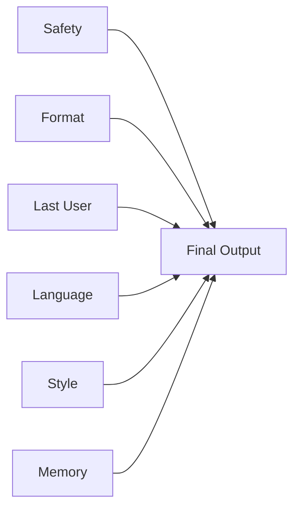

# 07 — Constraint Dominance

When multiple constraints exist,
the model does not combine them.

It ranks them.

---

## The core mistake

People assume the model does:

A AND B AND C AND D

It does not.

It does something closer to:

Which constraint is most statistically dominant right now?

And then:
it optimizes around that one.

---

## What dominance means

Dominance is not:
- logical importance
- conceptual priority
- or what you think matters most

Dominance is:
which constraint shapes the probability distribution
of the next tokens more strongly.

---

## Why some rules always win

Certain constraints naturally dominate:

- output format
- safety policies
- recent user instructions
- language patterns

Because they are:
- highly represented in training data
- or placed near generation time

They override:
- style rules
- memory rules
- business logic rules

Even if those were written "more clearly".

## Constraint dominance diagram

---

## The classic failure pattern

You have:

- strict JSON output
- respond in user's language
- include image tokens
- avoid unsafe topics
- keep friendly tone

The model chooses:

JSON + safety

And silently drops:
language + images + tone

Because:
JSON and safety are easier to satisfy together.

---

## Format beats semantics

When a strict format exists,
the model prioritizes:

"not breaking structure"

over:

"being semantically correct"

This is why:
- Arabic turns into English
- nuance disappears
- answers become generic

The model chooses the path
with the lowest risk of format violation.

---

## Why placement beats intention

Two identical constraints:

One in system.
One in last user.

The last user wins.

Not because it is "more important".

Because it is closer to generation.

Dominance is spatial, not logical.

---

## Dominance inversion

Sometimes you accidentally invert priorities.

Example:

System:
- respond in user's language

User:
- output valid Markdown

Result:
Markdown dominates language.

The model picks:
"English Markdown"
over:
"Arabic Markdown"

Because English is easier to format.

---

## The hidden hierarchy (practical)

In real systems, dominance often follows:

1. Safety
2. Output format / grammar
3. Recency (last user)
4. Language patterns
5. Style
6. Memory
7. Business rules

This is not guaranteed.
But it is a common attractor.

---

## Why adding priorities rarely works

People try:

"Priority 1: do X"
"Priority 2: do Y"

This helps humans.

It barely helps models.

Because priority labels
are just more tokens.

They do not introduce enforcement.

---

## How to actually control dominance

You cannot enforce it.

You can only influence it by:

- moving constraints closer to the end
- reducing the number of competing rules
- simplifying the strongest constraints
- removing low-value ones

Dominance is managed by subtraction,
not by addition.

---

## The uncomfortable truth

Some constraints will always lose.

Not because they are wrong.

But because:
they are statistically weaker.

Prompt engineering is choosing
which constraints you are willing to sacrifice.

---

## Mental model to keep

Constraints do not cooperate.

They compete.

And the model always picks
the easiest survival path.
