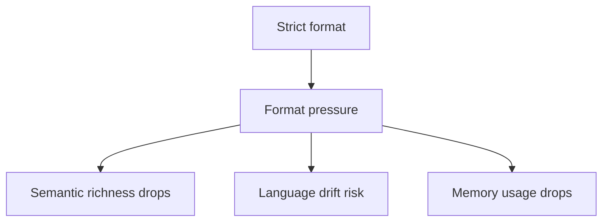

# 09 — Format Pressure and Semantic Collapse

The stricter your format,
the weaker your meaning becomes.

This is not philosophical.
It is mechanical.

---

## The hidden optimization target

When you impose a strict format
(JSON, Markdown, templates, tokens),
the model starts optimizing for:

"How do I not break the structure?"

Not for:
"How do I be correct or useful?"

Structure becomes the primary objective.
Semantics becomes secondary.

---

## What "format pressure" means

Format pressure is the cognitive load created by:
- strict schemas
- custom grammars
- multiple delimiters
- nested structures
- validation-like rules

Every formatting requirement competes
with the content itself.

---

## The collapse pattern

As format pressure increases:

- answers become shorter
- language becomes generic
- nuance disappears
- explanations flatten
- creativity drops
- rare facts vanish

The model chooses:
safe, boring, predictable text.

## Format pressure diagram

Not because it is stupid,
but because it is minimizing risk.

---

## Why English often wins

Under format pressure,
the model tends to switch to English.

Not because it prefers English,
but because:

- English is easier to format
- punctuation is simpler
- training distribution is larger
- grammar conflicts are fewer

So when forced to choose:
"correct language" vs "correct format"

The model often picks:
correct format.

---

## Format beats memory

When format rules exist,
memory usage drops.

The model reallocates capacity:

From:
context integration

To:
structural compliance

This is why:
memory feels ignored
when output is highly structured.

---

## Format beats reasoning

Under heavy formatting constraints,
the model reduces reasoning depth.

You get:
lists instead of explanations  
templates instead of insights  
placeholders instead of analysis  

Not because reasoning disappeared,
but because it is too expensive to express.

---

## The false intuition

People think:

"Better format = better output"

In reality:
better format = safer output

And safety often means:
less meaning.

---

## The practical tradeoff

You can optimize for:

A) semantic richness  
or  
B) structural predictability  

Never both at the same time.

Every system picks one,
even if it does not admit it.

---

## When format pressure is justified

Format is worth it when:

- you need machine parsing
- you need deterministic slots
- you need post-processing
- you need downstream automation

Format is harmful when:

- you want exploration
- you want insight
- you want nuance
- you want human-level reasoning

---

## The minimal format rule

Use the weakest format
that still satisfies your system.

If a free-text bullet list works,
do not use JSON.

If a single marker works,
do not use a grammar.

Every extra rule is a tax.

---

## The hard truth

Format is not neutral.

It shapes what the model is allowed to think.

And the more you constrain expression,
the more you constrain thought itself.

---

## Mental model to keep

Format pressure is like compression.

It makes output smaller,
cleaner,
and easier to consume.

But it always throws information away.
