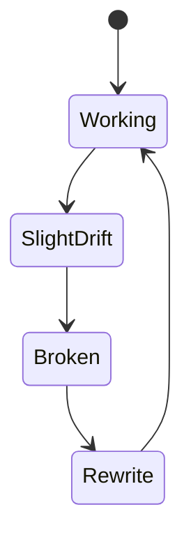

# 11 — Prompt Drift Over Time

A prompt is not a stable artifact.

Even if you never change it,
its behavior will change.

---

## The invisible drift

People assume:

"Same prompt = same behavior"

In reality:
models get updated,
sampling changes,
tokenizers shift,
alignment layers evolve.

Your prompt slowly becomes incompatible
with the model it was designed for.

---

## Why drift is hard to notice

Drift is usually:

- subtle
- gradual
- inconsistent

Nothing breaks completely.
Everything just becomes slightly worse.

Until one day:
your system "randomly" stops working.

---

## The common illusion

People blame:

- temperature
- randomness
- user behavior

But the real cause is:
the model changed,
not the prompt.

---

## Typical drift symptoms

- language starts switching
- format becomes less strict
- memory usage degrades
- safety becomes overly aggressive
- style becomes generic

All with the same prompt.

---

## Why drift is unavoidable

Because you do not control:
- the model weights
- the alignment layers
- the decoding strategy

You are building on a moving platform.

---

## The engineering reality

Every prompt has a half-life.

Not in days.
In deployments.

Each model update shortens
the original design assumptions.

## Drift cycle diagram

---

## Practical mindset

Treat prompts like dependencies.

They require:
- versioning
- regression testing
- periodic review

Not "write once and forget".

---

## Mental model to keep

Prompts do not break suddenly.

They rot.
