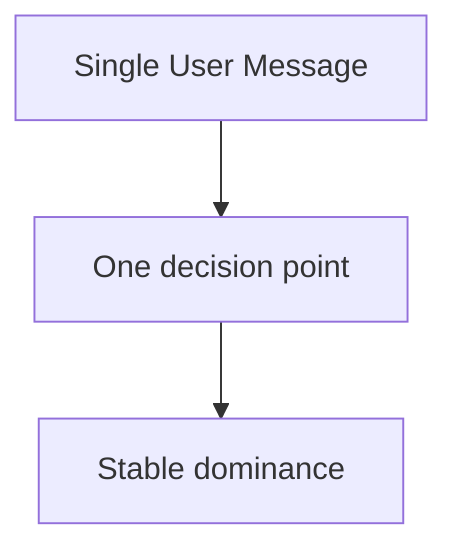

```
flowchart TD
  A[State summary] --> B[Overwrite memory]
  B --> C[High signal]
```

```
flowchart TD
  A[Local language rule near end] --> B[Recency activation]
  B --> C[Higher language adherence]
```

```
flowchart TD
  A[Minimal grammar] --> B[Lower format pressure]
  B --> C[Higher semantic richness]
```

```
flowchart TD
  A[Few rules] --> B[Low conflict]
  B --> C[Stable behavior]
```

```
flowchart TD
  A[Prompt core] --> B[External validation]
  B --> C[Deterministic control]
```